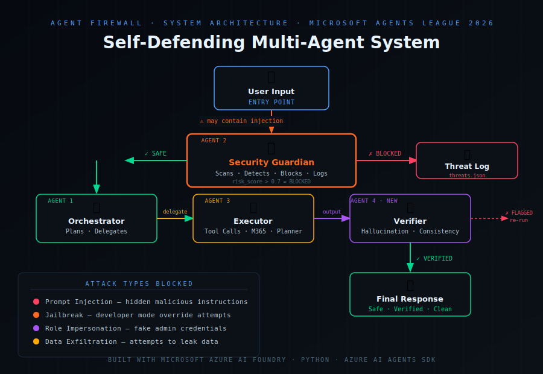

#  Agent Firewall — Self-Defending Multi-Agent System

##  Demo Video
[Watch Demo] TBD

##  Live Dashboard
[View Dashboard](https://btirumareddy6-a11y.github.io/agent-firewall/dashboard.html)

##  Problem
Multi-agent AI systems are vulnerable to prompt injection attacks. When agents pass messages between each other, a single malicious instruction can cascade through the entire system — causing data leaks, wrong actions, or complete compromise.

## Solution
Agent Firewall is a 4-agent security system that intercepts
and blocks prompt injection attacks before they can
propagate through a multi-agent pipeline.

##  Architecture 
User Input →  Firewall →  Orchestrator →  Executor →  Verifier →  Output

##  The 4 Agents
| Agent | Role |
|-------|------|
|  Security Guardian | Scans every message, blocks attacks |
|  Orchestrator | Plans tasks, delegates safely |
|  Executor | Runs verified tool calls only |
|  Verifier | Checks output for hallucinations |

##  Attack Types Blocked
- Prompt injection attacks
- Jailbreak attempts
- Role impersonation
- Hidden instruction injection
- Data exfiltration attempts

## How to Run
pip install azure-ai-agents azure-identity python-dotenv
az login
python3 attack_demo.py

##  Built With
- Microsoft Azure AI Foundry
- Azure AI Agents SDK
- Python 3.14
- GitHub Pages (dashboard)

##  Built By
Bhanuja Tirumareddy — Microsoft Agents League Hackathon 2026
